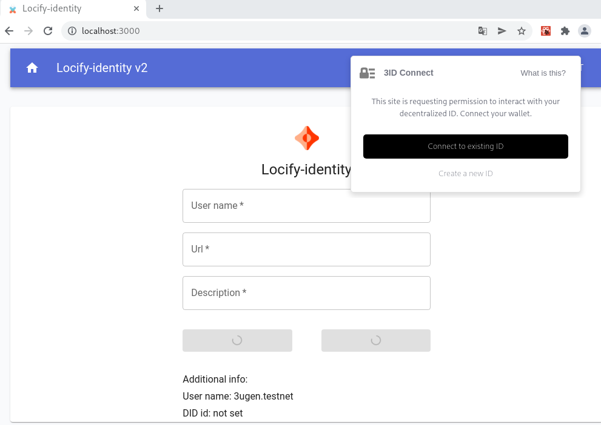

#### LOCIFY-IDENTITY demo app

####Example Near Protocol integration with Ceramic network. 
Libraries:

| Name                                                                        | Description                                                                                                                                                                                                                                              | 
|-----------------------------------------------------------------------------|----------------------------------------------------------------------------------------------------------------------------------------------------------------------------------------------------------------------------------------------------------|
| [Glaze libraries](https://developers.ceramic.network/tools/glaze/overview/) | The Glaze umbrella includes projects  providing low-level solutions on top of Ceramic.                                                                                                                                                               |
| [3ID Connect](https://github.com/ceramicstudio/3id-connect)                 | 3ID Connect provides 3ID user account management in a iframe,   an easy way to access a DID provider, specifically ThreeIdProvider in the browser.  It allows users to authenticate, manage, link and permission their 3ID keys to applications. |
| [NEAR-API-JS](https://github.com/near/near-api-js)                          | A JavaScript/TypeScript library for development of DApps on the NEAR                                                                                                                                                                                     |

## Setup

1. Clone this project
2. Install dependencies using `yarn install`
3. Start developer server `yarn run start`

## Reference
[Ceramic Self.ID application](https://developers.ceramic.network/tools/self-id/overview/#sdk)

Self.ID is a SDK for building user-centric Web applications using Ceramic and related decentralized technologies, along with a reference application to show and edit profiles.
